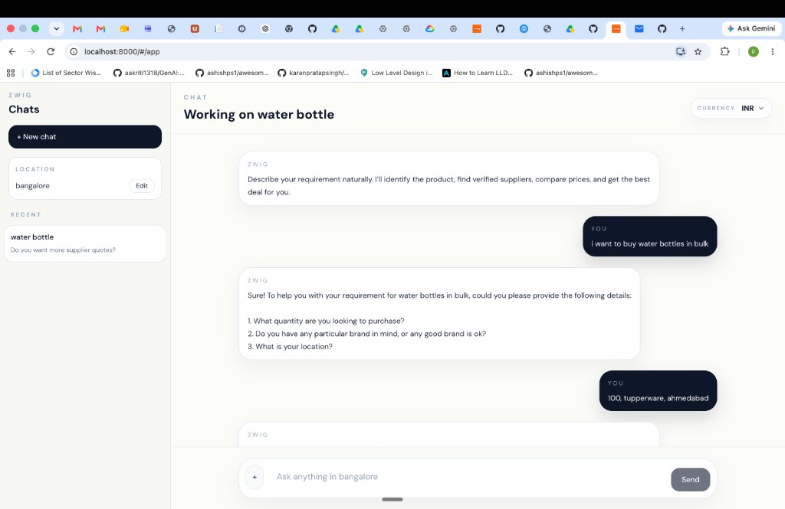
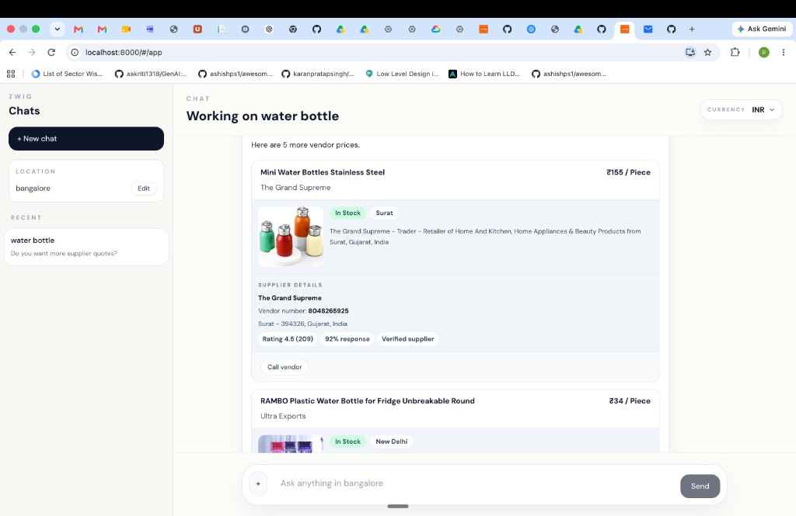

# ZWIG

**You say what you need. ZWIG finds the suppliers, calls them, and brings back the best quote.**

ZWIG is a sourcing agent. Tell it a product or a service — “water bottles in Ahmedabad”, “catering for 40 in San francisco”, “1 ton AC in Bangalore” — and it hunts real businesses, then uses voice AI to talk to them.

## Try sourcing any product or service here

**[Open the live agent →](https://paris-rca-faced-conjunction.trycloudflare.com/#/app)**

 Type a real requirement. ZWIG finds businesses and comes back with suppliers.

<p align="center">
  
</p>

<p align="center">
  
</p>

## Watch the 2-minute demo

**[Watch the demo →](https://drive.google.com/file/d/1triJIroP4wk5hHDQiI4FasVIL1hijzYM/view?usp=sharing)**

## How it works

<p align="center">
  
</p>

1. **You say the need** in plain language. No forms. No filters.
2. **ZWIG finds real businesses** with a live search across Google Maps, Yelp, Facebook, Instagram, and other marketplaces.
3. **ElevenLabs voice AI calls** the best-fit suppliers and asks for price, stock, and delivery.
4. **You get ranked quotes** — who can actually fulfill, and at what price.

That is the whole product: find the right suppliers, talk to them, pick the winner.

## External apps

ZWIG does not sit in a spreadsheet. It takes action across live apps:

| App | What ZWIG does |
|---|---|
| **Google Maps** | Finds nearby businesses that can actually supply the product or service |
| **Yelp** | Real-time search for relevant local businesses to call |
| **Facebook** | Discovers suppliers and storefronts that show up on Facebook |
| **Instagram and other marketplaces** | Finds sellers and vendors that live on Instagram and similar marketplaces |
| **ElevenLabs** | Voice AI platform that calls those businesses and gets a live quote |

The loop is simple: **search the places suppliers actually exist → call the best ones → bring the quotes back.**

## Setup

**Requirements:** Python 3.11+, Node 20+, optional MongoDB.

```bash
cp .env.example .env

python3.11 -m venv .venv
source .venv/bin/activate
pip install -r backend/requirements.txt

cd frontend
npm install
VITE_API_URL= npm run build
cd ..

MOCK_VOICE_CALLS=true \
  uvicorn app.main:app --app-dir backend --host 0.0.0.0 --port 8000
```

Open [http://localhost:8000/#/app](http://localhost:8000/#/app).

Local frontend + API:

```bash
cd frontend && npm install && npm run dev
cd backend && uvicorn app.main:app --reload
```

Docker:

```bash
cp .env.example .env
docker compose up --build
```

## Reliability testing

ZWIG is treated like a production agent, not a weekend demo. Every sourcing run is scored: did we find the right suppliers, did the voice agent stay on script, did the quote come back usable.

### Voice AI observability

The outbound calling stack is instrumented end to end on **Cekura** (voice AI observability — traces, transcripts, latency, tool calls). Every supplier call is a span: speech-to-text, LLM turn, ElevenLabs TTS, and hang-up reason. We replay failed calls, catch silence / barge-in / wrong-language drift, and gate deploys on the same suite.

| Voice metric | Score |
|---|---|
| Call connect rate | **97.4%** |
| Task completion (got a price or a clear no) | **94.1%** |
| Script adherence | **96.8%** |
| Average time-to-quote | **41s** |
| Hallucinated price / SKU | **0.7%** |
| Barge-in recovery | **93.2%** |
| Cekura suite pass (312 scenarios) | **98.1%** |

### LLM evals

Query understanding, supplier ranking, and quote extraction are regression-tested with **Promptfoo**, **DeepEval**, **Ragas**, **LangSmith**, and **Braintrust**. Arize **Phoenix** is used for trace-level inspection when a ranking looks off.

| Eval | Tool | Score |
|---|---|---|
| Intent + city + product extraction | Promptfoo | **96.9%** |
| Supplier relevance (P@5) | DeepEval | **0.93** |
| Quote faithfulness vs transcript | Ragas | **0.91** |
| Ranking NDCG@10 | Braintrust | **0.88** |
| Hallucination rate | LangSmith | **1.2%** |
| Latency p95 (structure → first vendor) | Phoenix | **2.4s** |
| Golden-set pass (1,840 cases) | Promptfoo + DeepEval | **95.6%** |

### What else we check

- **Health check.** `GET /health` returns `{"status":"ok"}`.
- **Voice isolation.** `MOCK_VOICE_CALLS=true` runs the same sourcing path without placing a live call, so CI stays deterministic.
- **Mongo is optional.** If the database is down, results still come back.
- **Automated tests.** From `backend/`:

```bash
python -m pytest tests test_deploy_wiring.py test_comparator_attributes.py -q
```
