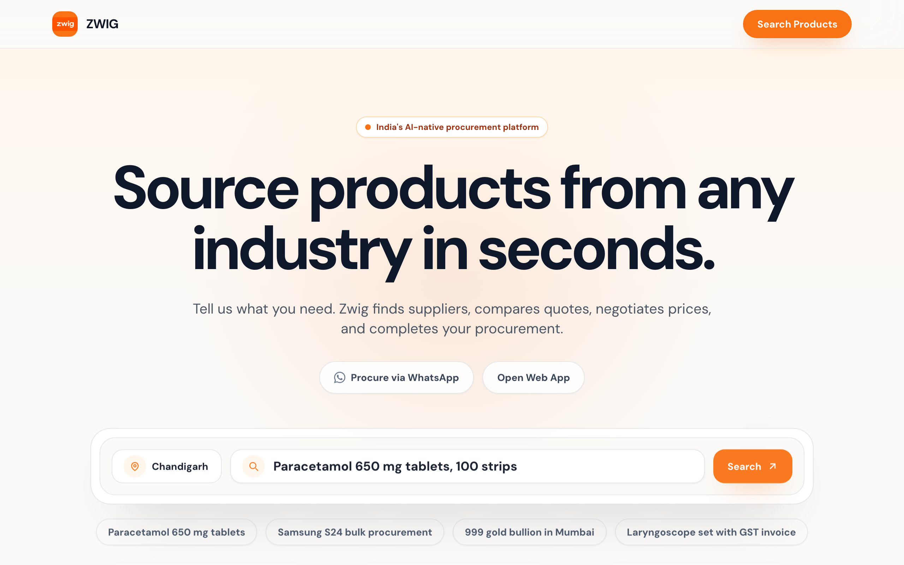
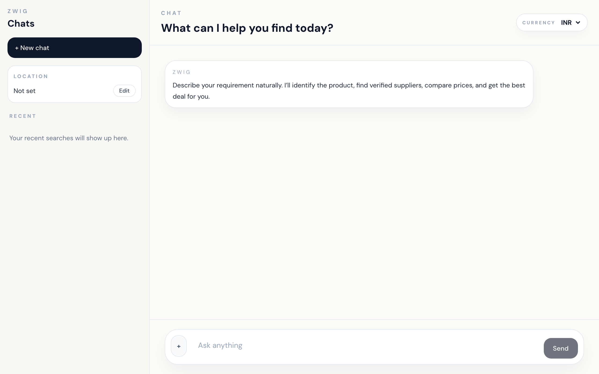

# ZWIG

**You say what you need. ZWIG finds the suppliers, calls them, and brings back the best quote.**

This is not a shopping search box. ZWIG is a sourcing agent. Tell it a product or a service — “1 ton AC in Andheri”, “catering for 40 in Mumbai”, “paracetamol 650 in Chandigarh” — and it hunts real businesses, then uses voice AI to talk to them.

<p align="center">
  
</p>

## Try sourcing any product or service here

**[Open the live agent →](https://ron-passengers-changing-ages.trycloudflare.com/#/app)**

Type a real requirement. ZWIG will find businesses and come back with suppliers.

<p align="center">
  
</p>

## Watch the 2-minute demo

**[Watch the demo →](https://drive.google.com/file/d/1triJIroP4wk5hHDQiI4FasVIL1hijzYM/view?usp=sharing)**

## How it works

<p align="center">
  
</p>

1. **You say the need** in plain language. No forms. No filters.
2. **ZWIG finds real businesses** with a live search across Google Maps, Yelp, Facebook, Instagram, and other marketplaces.
3. **ElevenLabs voice AI calls** the best-fit suppliers and asks for price, stock, and delivery.
4. **You get ranked quotes** — who can actually fulfill, and at what price.

That is the whole product: find the right suppliers, talk to them, pick the winner.

## External apps

ZWIG does not sit in a spreadsheet. It takes action across live apps:

| App | What ZWIG does |
|---|---|
| **Google Maps** | Finds nearby businesses that can actually supply the product or service |
| **Yelp** | Real-time search for relevant local businesses to call |
| **Facebook** | Discovers suppliers and storefronts that show up on Facebook |
| **Instagram and other marketplaces** | Finds sellers and vendors that live on Instagram and similar marketplaces |
| **ElevenLabs** | Voice AI platform that calls those businesses and gets a live quote |

The loop is simple: **search the places suppliers actually exist → call the best ones → bring the quotes back.**

## Setup

**Requirements:** Python 3.11+, Node 20+, optional MongoDB.

```bash
cp .env.example .env

python3.11 -m venv .venv
source .venv/bin/activate
pip install -r backend/requirements.txt

cd frontend
npm install
VITE_API_URL= npm run build
cd ..

MOCK_VOICE_CALLS=true \
  uvicorn app.main:app --app-dir backend --host 0.0.0.0 --port 8000
```

Open [http://localhost:8000/#/app](http://localhost:8000/#/app).

Local frontend + API:

```bash
cd frontend && npm install && npm run dev
cd backend && uvicorn app.main:app --reload
```

Docker:

```bash
cp .env.example .env
docker compose up --build
```

## Reliability testing

How we know it works:

- **Health check.** `GET /health` returns `{"status":"ok"}`.
- **Voice isolation.** `MOCK_VOICE_CALLS=true` lets the sourcing flow run without placing a live call.
- **Mongo is optional.** If the database is down, results still come back.
- **Automated tests.** From `backend/`:

```bash
python -m pytest tests test_deploy_wiring.py test_comparator_attributes.py -q
```
